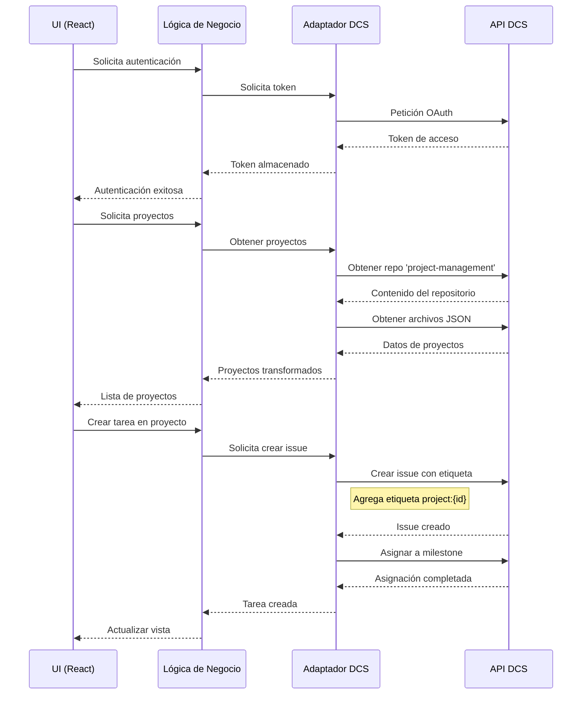
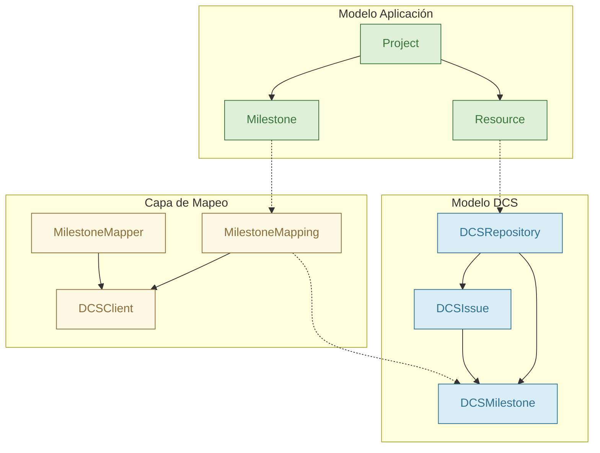

# Arquitectura del Sistema de Gestión de Proyectos DCS

## Visión General

El Sistema de Gestión de Proyectos DCS es una extensión de Theia que proporciona una interfaz unificada para gestionar proyectos de traducción a través de la integración con el Servicio de Contenido Door43 (DCS). La arquitectura está diseñada para mantener una clara separación de responsabilidades y facilitar la integración con la API de DCS.

## Diagrama de Arquitectura y Modelos

El siguiente diagrama muestra la relación entre el modelo de DCS, el modelo de nuestra aplicación, y cómo la capa adaptadora conecta ambos sistemas:

```mermaid
graph TB
    subgraph "Modelo DCS"
        DCS_Org[Organización]
        DCS_Repo[Repositorio]
        DCS_Issue[Issue]
        DCS_Milestone[Milestone]
        DCS_Label[Etiqueta]
        DCS_User[Usuario]
        
        DCS_Org --> DCS_Repo
        DCS_Repo --> DCS_Issue
        DCS_Repo --> DCS_Milestone
        DCS_Issue --> DCS_Label
        DCS_Issue --> DCS_Milestone
        DCS_User --> DCS_Issue
    end
    
    subgraph "Capa Adaptadora DCS"
        A_Auth[Módulo Autenticación]
        A_Projects[Módulo Proyectos]
        A_Tasks[Módulo Tareas]
        A_Milestones[Módulo Hitos]
        A_Repos[Módulo Repositorios]
        
        A_Auth --> A_Projects
        A_Auth --> A_Tasks
        A_Auth --> A_Milestones
        A_Auth --> A_Repos
    end
    
    subgraph "Modelo Aplicación"
        APP_Project[Proyecto]
        APP_Milestone[Hito]
        APP_Task[Tarea]
        APP_Team[Equipo]
        APP_Member[Miembro]
        
        APP_Project --> APP_Milestone
        APP_Project --> APP_Task
        APP_Project --> APP_Team
        APP_Team --> APP_Member
        APP_Milestone --> APP_Task
    end
    
    %% Conexiones entre DCS y Adaptador
    DCS_Org -.-> A_Projects
    DCS_Repo -.-> A_Repos
    DCS_Issue -.-> A_Tasks
    DCS_Milestone -.-> A_Milestones
    DCS_User -.-> A_Auth
    
    %% Conexiones entre Adaptador y Aplicación
    A_Projects -.-> APP_Project
    A_Tasks -.-> APP_Task
    A_Milestones -.-> APP_Milestone
    A_Repos -.-> APP_Project
    
    %% Repositorio Relacional (Especial)
    DCS_RelRepo[Repositorio Relacional<br>'project-management']
    DCS_Org --> DCS_RelRepo
    DCS_RelRepo -.-> A_Projects
    
    %% Mapeo especial de etiquetas
    DCS_ProjLabel[Etiqueta<br>'project:{project_id}']
    DCS_Issue --> DCS_ProjLabel
    DCS_ProjLabel -.-> A_Tasks
    
    style DCS_RelRepo fill:#f9d77e,stroke:#f0ad4e
    style DCS_ProjLabel fill:#f9d77e,stroke:#f0ad4e
    
    classDef modelDCS fill:#d9edf7,stroke:#31708f,color:#31708f;
    classDef modelApp fill:#dff0d8,stroke:#3c763d,color:#3c763d;
    classDef adapter fill:#fcf8e3,stroke:#8a6d3b,color:#8a6d3b;
    
    class DCS_Org,DCS_Repo,DCS_Issue,DCS_Milestone,DCS_Label,DCS_User modelDCS;
    class APP_Project,APP_Milestone,APP_Task,APP_Team,APP_Member modelApp;
    class A_Auth,A_Projects,A_Tasks,A_Milestones,A_Repos adapter;
```

## Flujo de Datos Detallado



## Capas de la Arquitectura

### 1. Capa de Presentación (UI)

- Implementada como una extensión de Theia
- Utiliza React con Tailwind CSS para los componentes
- Se integra con el workspace de Theia a través de widgets
- Mantiene la consistencia visual con el IDE

### 2. Capa de Lógica de Negocio

- Gestiona el estado de la aplicación
- Implementa la lógica de negocio específica del dominio
- Coordina las operaciones entre la UI y el adaptador DCS
- Maneja la validación y transformación de datos

### 3. Capa de Adaptador DCS

- Proporciona una interfaz unificada para interactuar con la API de DCS
- Abstrae los detalles de implementación de la API
- Maneja la autenticación y autorización
- Implementa el mapeo entre el modelo de datos interno y la API de DCS

## Modelo de Datos y Mapeo DCS

### Relación entre Modelos



### Estructuras de Datos Principales

#### 1. Modelo DCS

```typescript
interface DCSMilestone {
  id: number;
  title: string;
  description: string;
  state: 'open' | 'closed';
  due_on: string | null;
  created_at: string;
  updated_at: string;
  closed_at: string | null;
  closed_issues: number;
  open_issues: number;
}

interface DCSRepository {
  id: number;
  owner: {
    id: number;
    login: string;
    full_name: string;
  };
  name: string;
  full_name: string;
  description: string;
  private: boolean;
  fork: boolean;
  html_url: string;
  created_at: string;
  updated_at: string;
}

interface DCSIssue {
  id: number;
  number: number;
  title: string;
  body: string;
  state: 'open' | 'closed';
  milestone?: DCSMilestone;
  created_at: string;
  updated_at: string;
  closed_at: string | null;
}
```

#### 2. Capa de Mapeo

```typescript
interface MilestoneMapping {
  projectId: string;
  milestoneId: string;
  title: string;
  description: string;
  dueDate: string | null;
  dcsMilestones: DCSMilestoneRef[];
  metadata: {
    createdAt: string;
    updatedAt: string;
    completedAt?: string;
  };
}

interface DCSMilestoneRef {
  owner: string;          // Repository owner
  repo: string;           // Repository name
  milestoneId: number;    // DCS milestone ID
  state: 'open' | 'closed';
  issueCount: {
    open: number;
    closed: number;
  };
}
```

#### 3. Modelo de Aplicación

```typescript
interface Milestone {
  id: string;
  name: string;
  description: string;
  dueDate?: Date;
  status: MilestoneStatus;
  progress: number;
  projectId: string;
}

interface Resource {
  id: string;
  name: string;
  description: string;
  repositoryUrl: string;
  projectId: string;
  metadata: {
    createdAt: string;
    updatedAt: string;
    lastSyncedAt?: string;
  };
}
```

### Flujo de Datos en el Mapeo de Hitos

1. **Creación de Hito**
   ```mermaid
   sequenceDiagram
       participant App as Aplicación
       participant Mapper as MilestoneMapper
       participant DCS as DCS API
       
       App->>Mapper: createMilestoneAcrossResources(projectId, milestone, resources)
       loop Para cada recurso
           Mapper->>DCS: createMilestone(owner, repo, data)
           DCS-->>Mapper: DCSMilestone
       end
       Mapper-->>App: MilestoneMapping
   ```

2. **Actualización de Progreso**
   ```mermaid
   sequenceDiagram
       participant App as Aplicación
       participant Mapper as MilestoneMapper
       participant DCS as DCS API
       
       App->>Mapper: getMilestoneProgress(mapping)
       loop Para cada DCSMilestoneRef
           Mapper->>DCS: getMilestones(owner, repo)
           DCS-->>Mapper: DCSMilestone[]
           Mapper->>Mapper: Calcular progreso
       end
       Mapper-->>App: MilestoneProgress
   ```

### Estrategias de Sincronización

1. **Sincronización Unidireccional**
   - La aplicación es la fuente de verdad para la estructura del proyecto
   - Los cambios fluyen desde la aplicación hacia DCS
   - Los datos de progreso fluyen desde DCS hacia la aplicación

2. **Manejo de Conflictos**
   - Los hitos en DCS mantienen referencia al proyecto mediante metadatos
   - Los cambios directos en DCS son detectados y sincronizados
   - Se mantiene un registro de última sincronización

3. **Consistencia de Datos**
   - Uso de transacciones para operaciones multi-repositorio
   - Validación de estado antes de actualizaciones
   - Registro de intentos fallidos para recuperación

## Flujos de Datos

### 1. Obtención de Proyectos

1. Autenticación con DCS
2. Acceso al repositorio relacional de la organización
3. Lectura de archivos JSON de definición de proyectos
4. Transformación a modelo de datos interno

### 2. Obtención de Tareas

1. Lectura de la definición del proyecto
2. Obtención de repositorios vinculados
3. Consulta de issues en cada repositorio
4. Filtrado por etiqueta de proyecto (`project:{project_id}`)
5. Agrupación y presentación de tareas

### 3. Obtención de Hitos

1. Lectura de la definición del proyecto
2. Extracción de la sección de hitos
3. Mapeo con hitos de DCS en repositorios vinculados
4. Cálculo de progreso basado en tareas asociadas

### 4. Obtención de Tareas por Hito

1. Lectura de la definición del proyecto
2. Identificación del hito específico
3. Obtención de tareas del proyecto
4. Filtrado por asociación con el hito

## Integración con DCS

### Autenticación

- Implementación de OAuth con DCS
- Almacenamiento seguro de tokens
- Manejo de renovación de tokens

### Operaciones de API

1. **Gestión de Repositorios**
   - Creación de repositorios
   - Acceso a repositorios existentes
   - Gestión de permisos

2. **Gestión de Issues**
   - Creación de issues
   - Etiquetado de issues
   - Asignación de issues
   - Actualización de estado

3. **Gestión de Hitos**
   - Creación de hitos
   - Vinculación con issues
   - Seguimiento de progreso

## Consideraciones de Implementación

### Rendimiento

- Caché de datos frecuentemente accedidos
- Paginación de resultados
- Optimización de consultas a la API

### Seguridad

- Manejo seguro de credenciales
- Validación de datos de entrada
- Sanitización de datos de salida

### Mantenibilidad

- Separación clara de responsabilidades
- Documentación de interfaces
- Pruebas unitarias y de integración

## Pruebas

### Estrategia de Pruebas

1. **Pruebas Unitarias**
   - Componentes UI
   - Lógica de negocio
   - Adaptador DCS

2. **Pruebas de Integración**
   - Flujos completos
   - Interacción con DCS
   - Rendimiento

3. **Pruebas End-to-End**
   - Flujos de usuario completos
   - Escenarios de error
   - Casos de uso principales
