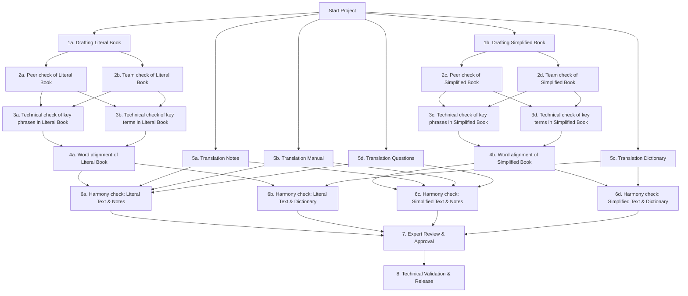

# Biblical Translation Project Management System

## Overview

This project is a translation project management system designed to work with Door43 Content Service (DCS), an open-source GitHub platform specifically focused on biblical and religious content translation. The system integrates with DCS's API (git.door43.org) to facilitate the management and coordination of biblical translation projects.

## Current Use Case: Facilitating Minority Language Bible Translation

This system addresses a specific need: enabling Bible translation for minority language communities through strategic intermediary languages.

**The Challenge**: Many minority language translators don't have access to biblical source language expertise (Hebrew, Greek, Aramaic), making direct translation impossible.

**Our Solution**: We provide comprehensive "Book Translation Packages" that enable translators to work from a strategic language they understand (e.g., Spanish, Portuguese) to their minority language without requiring knowledge of the original biblical languages.

### Book Translation Package Components

Each package contains six essential resources for translators:

1. **Literal Translation of the Book for Translators ({lang}_glt)** - A version that closely follows the structure of the original language
2. **Simplified Translation of the Book for Translators ({lang}_gst)** - An easier-to-understand version with simplified grammar and vocabulary
3. **Translation Notes ({lang}_tn)** - Detailed explanatory notes from translation consultants to aid translators with difficult passages
4. **Translation Dictionary ({lang}_tw)** - A specialized dictionary covering theological terms, proper names, and culturally challenging concepts
5. **Translation Academy ({lang}_ta)** - Educational articles about grammar, translation principles, and decision-making guidance
6. **Translation Questions ({lang}_tq)** - Verse-by-verse comprehension questions to verify translation clarity and naturalness

## Comprehensive 8-Milestone Translation Process

Our organization follows a structured 8-milestone process for creating a Book Translation Package for each book of the Bible. Each milestone has specific objectives, methodologies, quality standards, and deliverables.

### Milestone 1: Drafting Phase

#### 1a. Drafting Literal Book ({lang}_glt)

**Description**: The book is divided into chunks (usually verses or small paragraphs) and translated with a focus on maintaining the structure of the original biblical languages.

**Participants**: Experienced translators with biblical language knowledge

**Methodology**:

- Verse-by-verse or chunk-by-chunk translation
- Prioritizing structural fidelity to original language
- Preserving word order and grammatical features where possible
- Maintaining consistent terminology

**Quality Indicators**:

- Accuracy to source text
- Preservation of original language constructions
- Consistent handling of recurring terms
- Completeness of content

**Deliverables**: Complete literal translation in chunks, with annotations about difficult passages

#### 1b. Drafting Simplified Book ({lang}_gst)

**Description**: Creating a simplified version that maintains accuracy but uses natural language patterns to enhance comprehension.

**Participants**: Translators specializing in clear communication

**Methodology**:

- Assignment of verses or chunks to be translated
- Restructuring complex sentences
- Clarifying implicit information
- Using common vocabulary
- Maintaining full meaning while simplifying expression

**Quality Indicators**:

- Readability for target audience
- Natural language patterns
- Clarity of expression
- Preservation of complete meaning

**Deliverables**: Complete simplified translation in natural language, with annotations about adaptation decisions

### Milestone 2: Initial Review Phase

#### 2a. Peer Check of Literal Book

**Description**: Two translators meet to review each other's work, providing feedback and corrections.

**Participants**: Translation pairs with complementary skills

**Methodology**:

- Back-translation comparison
- Source text verification
- Discussion of translation choices
- Error identification and correction

**Quality Indicators**:

- Accuracy of word choices
- Grammatical correctness
- Fidelity to source text
- Consistency in style

**Deliverables**: Peer-reviewed literal translation with tracked changes and comments

#### 2b. Team Check of Literal Book

**Description**: The entire translation team reviews the complete literal book translation together.

**Participants**: All team translators led by a senior translator

**Methodology**:

- Group reading sessions
- Discussion of challenging passages
- Standardization of terminology
- Consistency checks across chapters

**Quality Indicators**:

- Whole-book consistency
- Proper handling of recurring themes
- Accuracy at book level
- Unified translation approach

**Deliverables**: Team-approved literal translation with resolved issues and standardized terminology

#### 2c. Peer Check of Simplified Book

**Description**: Similar to 2a, but focused on readability and natural expression in the simplified version.

**Participants**: Translation pairs with communication expertise

**Methodology**:

- Readability assessment
- Comprehension testing
- Evaluation of simplified language choices
- Verification of meaning preservation

**Quality Indicators**:

- Naturalness of expression
- Clarity of meaning
- Appropriate vocabulary level
- Readability metrics

**Deliverables**: Peer-reviewed simplified translation with improvements in clarity and readability

#### 2d. Team Check of Simplified Book

**Description**: Complete team review of the simplified book translation, focusing on consistency and communication effectiveness.

**Participants**: All team translators with input from communication specialists

**Methodology**:

- Reading for flow and clarity
- Standardization of simplified terminology
- Consistency checks across chapters
- Evaluation of overall readability

**Quality Indicators**:

- Consistent tone and style
- Natural language patterns
- Effective simplification strategies
- Maintenance of full meaning

**Deliverables**: Team-approved simplified translation with consistent approach to simplification

### Milestone 3: Technical Validation Phase

#### 3a. Technical Check of Key Phrases in Literal Book

**Description**: Detailed examination of specific phrases to ensure they maintain appropriate literal form.

**Participants**: Technical reviewers with biblical language expertise

**Methodology**:

- Identification of key phrases that require literal rendering (Using the source language Translation Notes and Translation Academy for guidance)
- Verification against original language structures
- Analysis of phrasal patterns for consistency
- Correction of phrases that deviate from literalness

**Quality Indicators**:

- Proper handling of idioms and figures of speech
- Consistent rendering of repeated phrases
- Preservation of important structural elements
- Accuracy in technical language

**Deliverables**: Verified key phrases that accurately reflect original language patterns

#### 3b. Technical Check of Key Terms in Literal Book

**Description**: Verification of consistent translation of theological terms, names, and important concepts.

**Participants**: Theological experts and terminologists

**Methodology**:

- Identification of key terms that require literal rendering and repeated terms that require consistent rendering (Using the source language Translation Words dictionary for guidance)
- Verification of consistent rendering
- Correction of inconsistent terminology
- Documentation of term choices

**Quality Indicators**:

- Consistent terminology use
- Accuracy in theological concepts
- Proper handling of technical terms
- Documentation of term decisions

**Deliverables**: Standard term glossary specific to the book with verified consistency

#### 3c. Technical Check of Key Phrases in Simplified Book

**Description**: Similar to 3a, but ensuring key phrases in the simplified version effectively communicate the original meaning.

**Participants**: Communication specialists with biblical knowledge

**Methodology**:

- Identification of key phrases that require simplified rendering (Using the source language Translation Notes and Translation Academy for guidance)
- Comparison of simplified phrases with their literal counterparts
- Evaluation of meaning preservation despite structural changes
- Verification that simplification doesn't alter key concepts
- Documentation of simplification strategies

**Quality Indicators**:

- Meaning equivalence despite simplification
- Clarity of expression
- Effectiveness of communication
- Preservation of key concepts

**Deliverables**: Verified simplified phrases that effectively communicate original meaning

#### 3d. Technical Check of Key Terms in Simplified Book

**Description**: Ensuring consistent and clear handling of key terms in the simplified translation.

**Participants**: Terminologists and communication specialists

**Methodology**:

- Identification of key terms that require simplified rendering and repeated terms that require consistent rendering (Using the source language Translation Words dictionary for guidance)
- Evaluation of term accessibility
- Verification of consistent use
- Documentation of simplification strategies
- Comparison with literal version terms

**Quality Indicators**:

- Appropriate term choices for target audience
- Consistency throughout the book
- Clarity of technical terms
- Balance between accuracy and simplicity

**Deliverables**: Simplified glossary with approved term handling strategies

### Milestone 4: Alignment Phase

#### 4a. Word Alignment of Literal Book

**Description**: Each word or unit of meaning is aligned with the original source text to ensure nothing is added or missing and structure is maintained as much as possible.

**Participants**: Alignment specialists with source language expertise

**Methodology**:

- Word-by-word mapping to source text, verse-by-verse
- Verification that all original content is represented
- Identification of implied information
- Documentation of alignment decisions

**Quality Indicators**:

- Complete representation of source content
- Proper handling of linguistic structures
- Clear alignment between source and target
- Documentation of challenging alignments

**Deliverables**: Fully aligned literal text with verifiable mapping to source

#### 4b. Word Alignment of Simplified Book

**Description**: Meaning-based alignment ensuring the simplified text preserves all units of meaning from the source.

**Participants**: Alignment specialists with communication expertise

**Methodology**:

- Concept mapping between source and simplified text, verse-by-verse
- Verification that restructured content preserves all meaning
- Documentation of adaptation strategies
- Cross-check with literal version

**Quality Indicators**:

- Complete representation of source meaning
- Effective handling of restructured content
- Documentation of adaptation decisions
- Verification of content preservation

**Deliverables**: Verified simplified text that preserves all source meanings in accessible form

### Milestone 5: Supporting Resources Translation Phase

#### 5a. Translation Notes

**Description**: Translation and creation of explanatory notes that aid translators in understanding difficult passages, cultural concepts, and translation challenges.

**Participants**: Exegetical specialists and cultural experts

**Methodology**:

- Notes assignment by section
- Adaptation for cultural relevance
- Verification against source notes
- Ensuring clarity for target translators

**Quality Indicators**:

- Clarity of explanations
- Helpfulness for target translators
- Accuracy of information
- Cultural appropriateness

**Deliverables**: Complete set of translated notes linked to specific verses and passages

#### 5b. Translation Manual Articles

**Description**: Translation of articles explaining translation principles, grammatical concepts, and best practices relevant to the book.

**Participants**: Translation theorists and practitioners

**Methodology**:

- Assignment of book relevant manual articles
- Adaptation for target audience
- Enhancement with culturally relevant examples
- Focus on practical application

**Quality Indicators**:

- Clarity of instruction
- Practicality for target translators
- Doctrinal accuracy
- Cultural relevance

**Deliverables**: Translated manual articles addressing the book's specific translation challenges

#### 5c. Translation Dictionary Entries

**Description**: Creating dictionary entries for key terms, names, and concepts in the book.

**Participants**: Lexicographers and theological specialists

**Methodology**:

- Term assignment based on book content
- Definition crafting for target context
- Example selection from the book
- Cross-referencing with other resources

**Quality Indicators**:

- Accuracy of definitions
- Clarity of explanations
- Usefulness for translation decisions
- Comprehensiveness of coverage

**Deliverables**: Complete set of translated dictionary entries specific to the book

#### 5d. Translation Questions

**Description**: Developing comprehension questions and answers that help verify translation accuracy and understanding.

**Participants**: Curriculum developers and translation checkers

**Methodology**:

- Question assignment for key verses
- Answer preparation
- Adaptation to cultural context
- Focus on meaning verification

**Quality Indicators**:

- Questions that effectively test comprehension
- Answers that clearly indicate understanding
- Coverage of key concepts
- Cultural appropriateness

**Deliverables**: Complete set of questions and answers for the entire book

### Milestone 6: Harmonization Phase

#### 6a. Harmonizing Literal Text with Notes

**Description**: Ensuring coherence between the literal text and translation notes, so explanations match the translated text.

**Participants**: Reviewers with expertise in both translation and notes

**Methodology**:

- Side-by-side comparison of text and notes
- Verification that notes accurately explain translation choices
- Identification of gaps in explanation
- Correction of discrepancies

**Quality Indicators**:

- Alignment between text and explanations
- Comprehensive note coverage for difficult passages
- Consistency in terminology
- Clear connections between text and notes

**Deliverables**: Harmonized text and notes with verified cross-references

#### 6b. Harmonizing Literal Text with Dictionary

**Description**: Ensuring consistency between terms used in the literal text and their dictionary entries.

**Participants**: Terminologists and text reviewers

**Methodology**:

- Term extraction from text
- Verification against dictionary entries
- Consistency checking
- Correction of discrepancies

**Quality Indicators**:

- Consistent application of dictionary definitions
- Comprehensive dictionary coverage
- Clear connections between text and dictionary
- Documentation of term usage

**Deliverables**: Consistent terminology usage across text and dictionary resources

#### 6c. Harmonizing Simplified Text with Notes

**Description**: Similar to 6a, but focusing on coherence between simplified text and explanatory notes.

**Participants**: Communication specialists and note reviewers

**Methodology**:

- Verification that notes support simplified rendering
- Identification of explanation gaps
- Adaptation of notes for simplified text
- Cross-checking with literal version notes

**Quality Indicators**:

- Notes that effectively explain simplified passages
- Comprehensive explanatory coverage
- Clarity in explanation of adaptations
- Appropriate level of detail

**Deliverables**: Harmonized simplified text and supporting notes

#### 6d. Harmonizing Simplified Text with Dictionary

**Description**: Ensuring the simplified text's terminology is consistent with dictionary entries.

**Participants**: Terminology specialists focusing on accessible language

**Methodology**:

- Term extraction from simplified text
- Comparison with dictionary entries
- Consistency checking
- Adaptation of entries for simplified terms

**Quality Indicators**:

- Appropriate application of simplified terminology
- Dictionary coverage of all simplified terms
- Clarity in explanation of term choices
- Consistency throughout resources

**Deliverables**: Consistent terminology across simplified text and dictionary resources

### Milestone 7: Expert Review Phase

**Description**: Scholars and subject matter experts review and approve all resources by checking each chunk of the book and related materials.

**Participants**: Biblical scholars, linguists, theological experts, and experienced translation consultants

**Methodology**:

- Assignment of book chunks to be reviewed
- Comprehensive review of all translated resources
- Scholarly evaluation of accuracy and helpfulness
- Documentation of feedback
- Implementation of expert suggestions

**Quality Indicators**:

- Theological accuracy
- Linguistic quality
- Overall resource cohesion
- Usefulness for target translators

**Deliverables**: Expert-approved package with documented review feedback and final adjustments

### Milestone 8: Technical Finalization Phase

**Description**: Technical team performs format validation on all resources and prepares them for release on git.door43.org.

**Participants**: Technical specialists, publishing experts, and metadata managers

**Methodology**:

- Format validation using automated scripts
- Metadata completion and verification
- Cross-reference checking
- Final quality assurance

**Quality Indicators**:

- Technical accuracy
- Format compliance
- Completeness of package
- Proper metadata and documentation

**Deliverables**: Publication-ready package in DCS with complete metadata, versioning, and accessibility features

### Workflow Visualization

The following diagram illustrates the dependencies between the different milestones in our process:

#### Parallel Work Opportunities

- Milestone 1 tasks (Drafting) and Milestone 5 tasks (Supporting Resources Translation) can be started simultaneously at the beginning of the project
- Milestones 1a and 1b can be worked on simultaneously
- After 1a is complete, 2a and 2b can be done in parallel
- After 1b is complete, 2c and 2d can be done in parallel
- After 2a/2b are complete, 3a and 3b can be done in parallel
- After 2c/2d are complete, 3c and 3d can be done in parallel
- After 3a/3b and 3c/3d are complete, 4a and 4b can be done respectively
- All of 5a-5d (Translation Notes, Manual, Dictionary, Questions) can be worked on in parallel with each other
- The harmonization checks (6a-6d) require both the completion of Milestone 4 tasks (Alignment) and Milestone 5 tasks (Supporting Resources)
- After 6a-6d are complete, Milestones 7 and 8 must be done sequentially

### Extensibility Goals

While the initial focus is on managing Book Translation Package projects, the system is being designed for extensibility to eventually support:

- Direct minority language Bible translation project management
- Other types of biblical and religious content translation
- Additional resource types as translation methodologies evolve

## Purpose

The main purpose of this system is to:

- Streamline the management of biblical translation projects
- Facilitate collaboration between translators, reviewers, and project managers
- Provide real-time tracking of translation progress
- Integrate seamlessly with DCS's version control and content management features

## Features

- **Project Dashboard**
  - Overview of all active translation projects
  - Progress tracking and status updates
  - Resource allocation monitoring
  - Visual tracking of Book Translation Package components

- **Translation Workflow Management**
  - Task assignment and tracking
  - 8-step process implementation and monitoring
  - Review process management
  - Version control integration with DCS

- **Resource Management**
  - Book Translation Package component tracking
  - Strategic language resource organization
  - Source text management
  - Reference material organization
  - Translation memory integration

- **Collaboration Tools**
  - Comment and feedback system
  - Real-time notifications
  - Team communication features
  - Consultant-translator interaction facilitation

## Technical Stack

- Backend: [To be determined]
- Frontend: [To be determined]
- API Integration: DCS API (git.door43.org/api/swagger)
- Authentication: OAuth integration with DCS

## Getting Started

[Installation and setup instructions will be added as the project develops]

## API Integration

This project integrates with the Door43 Content Service API. Key API features utilized include:

- Repository management
- Content access and modification
- User authentication
- Version control operations

## Contributing

We welcome contributions to this project. Please read our contributing guidelines [link to be added] before submitting pull requests.

## License

[License information to be determined]

## Contact

[Contact information to be added]

---
*This project is not officially affiliated with Door43 but utilizes their open-source API for biblical content management.*
