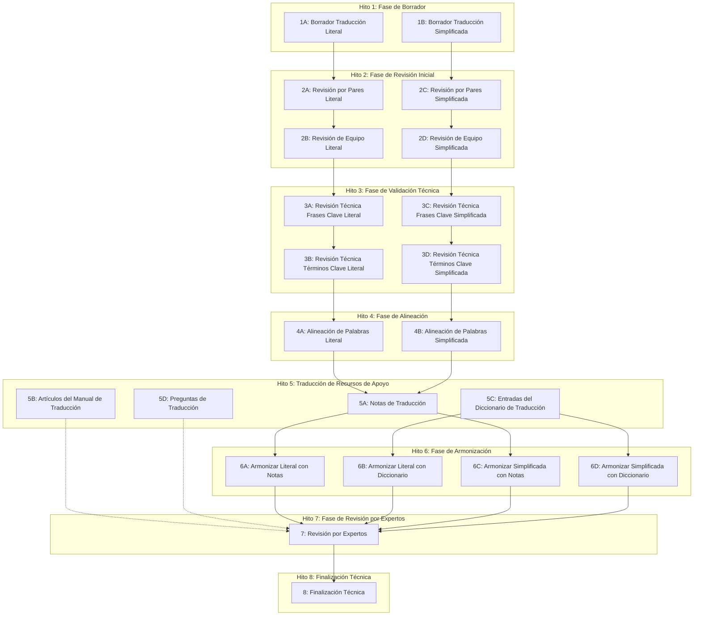

# Proceso de Producción de Paquetes de Traducción de Libros: Visualización del Flujo de Trabajo

Este documento proporciona representaciones visuales del flujo de trabajo existente para la creación del Paquete de Traducción de Libros y explica las dependencias entre diferentes hitos y componentes. Entender estos flujos de trabajo es esencial para diseñar nuestro Sistema de Gestión de Proyectos de Traducción Bíblica para apoyar efectivamente el proceso de traducción.

## Estructura de Flujo de Trabajo Establecida

El Proceso de Producción de Paquetes de Traducción de Libros sigue un flujo de trabajo estructurado con dependencias claras y pistas paralelas. Nuestra aplicación de gestión de proyectos será diseñada para representar, rastrear y optimizar este flujo de trabajo.

## Integración de Repositorios

El flujo de trabajo se integra con la organización estructurada de recursos en repositorios Git dedicados dentro de la plataforma Door43 Content Service (DCS). El flujo de trabajo establecido aprovecha este enfoque modular de repositorios para permitir:

- **Pistas de Desarrollo Paralelas**: Los equipos pueden trabajar simultáneamente en diferentes repositorios (por ejemplo, traducción literal, traducción simplificada, notas)
- **Transiciones Claras entre Hitos**: Cada repositorio progresa a través de los hitos con puntos claros de transferencia
- **Gestión de Dependencias**: La estructura del repositorio se mapea a las dependencias mostradas en el diagrama de flujo de trabajo
- **Puntos de Integración**: Los repositorios se unen en hitos específicos (particularmente alineación y armonización)
- **Seguimiento del Progreso**: El estado puede ser monitoreado a través de los repositorios para visualizar el avance general del proyecto

## Diagrama de Flujo de Proceso

El siguiente diagrama representa el flujo de trabajo establecido del Proceso de Producción de Paquetes de Traducción de Libros:

## Dependencias en el Proceso Establecido

El proceso de traducción involucra varias dependencias clave:

1. **Dependencias Secuenciales para Cada Pista**:
   - La Traducción Literal progresa desde Borrador → Revisión Inicial → Validación Técnica → Alineación
   - La Traducción Simplificada sigue la misma secuencia en paralelo

2. **Dependencias Entre Pistas**:
   - Tanto la Traducción Literal como la Simplificada deben alcanzar la fase de Alineación (M4) antes de que las Notas de Traducción (M5A) puedan comenzar
   - Las Notas de Traducción y las Entradas del Diccionario deben estar completas antes de que la Armonización (M6) pueda comenzar

3. **Dependencias de Fase Final**:
   - Todas las tareas de Armonización deben estar completas antes de la Revisión por Expertos
   - La Revisión por Expertos debe estar completa antes de la Finalización Técnica

## Oportunidades de Trabajo Paralelo en el Proceso Establecido

El flujo de trabajo está diseñado para optimizar la eficiencia a través de oportunidades de trabajo paralelo:

1. **Desarrollo Inicial Paralelo**:
   - Las traducciones Literal y Simplificada pueden ser redactadas y revisadas simultáneamente
   - Sus pistas de desarrollo permanecen independientes hasta el Hito 5

2. **Paralelización de Recursos de Apoyo**:
   - Una vez que las traducciones alcanzan el Hito 4, múltiples recursos de apoyo pueden ser desarrollados concurrentemente
   - Las Notas de Traducción, Artículos del Manual, Entradas del Diccionario y Preguntas pueden progresar en paralelo

3. **Paralelización de Armonización**:
   - Múltiples tareas de armonización pueden realizarse simultáneamente una vez que se cumplan sus dependencias

## Ruta Crítica en el Proceso Establecido

La ruta crítica a través del proceso de traducción típicamente sigue la siguiente secuencia:

1. Borrador de Traducción Literal
2. Revisión y Validación Técnica de la Traducción Literal
3. Alineación de la Traducción Literal
4. Creación de Notas de Traducción
5. Armonización de la Traducción Literal con las Notas
6. Revisión por Expertos
7. Finalización Técnica

Esto representa la secuencia mínima de pasos requeridos para completar un Paquete de Traducción de Libros. Los retrasos en cualquiera de estos pasos impactarán directamente la línea de tiempo del proyecto, mientras que otros pasos (como la Traducción Simplificada) generalmente tienen algo de tiempo de flotación.

## Cómo Nuestro Sistema de Gestión de Proyectos de Traducción Bíblica Apoyará Este Flujo de Trabajo

Nuestra aplicación de gestión de proyectos proporcionará características especializadas para apoyar, visualizar y optimizar este flujo de trabajo establecido:

### Visualización del Flujo de Trabajo

Nuestra aplicación:
- Proporcionará diagramas interactivos del flujo de trabajo de traducción
- Mostrará el estado en tiempo real de cada tarea e hito
- Resaltará elementos de ruta crítica y potenciales cuellos de botella
- Visualizará dependencias entre diferentes pistas

### Gestión de Dependencias

Nuestra aplicación:
- Hará cumplir la finalización de prerrequisitos antes de que puedan comenzar tareas dependientes
- Alertará a los gestores de proyectos cuando las dependencias puedan causar retrasos
- Facilitará las transferencias entre tareas secuenciales
- Mantendrá dependencias entre repositorios

### Coordinación de Trabajo Paralelo

Nuestra aplicación:
- Identificará oportunidades para trabajo paralelo
- Ayudará a asignar recursos a través de pistas paralelas
- Rastreará el progreso de flujos de trabajo independientes
- Resaltará cuando las pistas paralelas necesiten converger

### Monitoreo de Ruta Crítica

Nuestra aplicación:
- Identificará y resaltará tareas de ruta crítica
- Proporcionará advertencias tempranas para posibles retrasos en tareas críticas
- Calculará el tiempo de flotación para tareas no críticas
- Ayudará a optimizar la asignación de recursos para mantener el progreso de la ruta crítica

### Características de Seguimiento de Progreso

El Sistema de Gestión de Proyectos de Traducción Bíblica proporcionará herramientas para rastrear el progreso a través de este flujo de trabajo, incluyendo:

- **Tableros de Estado**: Representación visual del estado de hitos y tareas
- **Visualización de Tareas**: Tableros estilo Kanban mostrando tareas completadas, en progreso y pendientes
- **Seguimiento de Asignación de Recursos**: Monitoreo de asignaciones de miembros del equipo a través de pistas paralelas
- **Identificación de Cuellos de Botella**: Resaltado automatizado de restricciones de flujo de trabajo
- **Proyecciones de Línea de Tiempo**: Pronósticos basados en el progreso actual y asignación de recursos

### Adaptabilidad para Otros Procesos de Traducción

Aunque inicialmente se centra en apoyar el Proceso de Producción de Paquetes de Traducción de Libros, nuestro sistema será diseñado con la flexibilidad para apoyar otros flujos de trabajo de traducción en el futuro, tales como:

- **Traducción Bíblica en Lenguas Minoritarias**: Traducción directa desde idiomas puente a lenguas minoritarias
- **Creación de Recursos Especializados**: Creación de recursos específicos como comentarios o guías de estudio
- **Flujos de Trabajo Personalizados**: Creación de flujos de trabajo definidos por el usuario para proyectos de traducción especializados

---

Siguiente: Ver los [Detalles Técnicos](./technical.md)  
Volver a [Inicio de la Documentación](./README.md) 