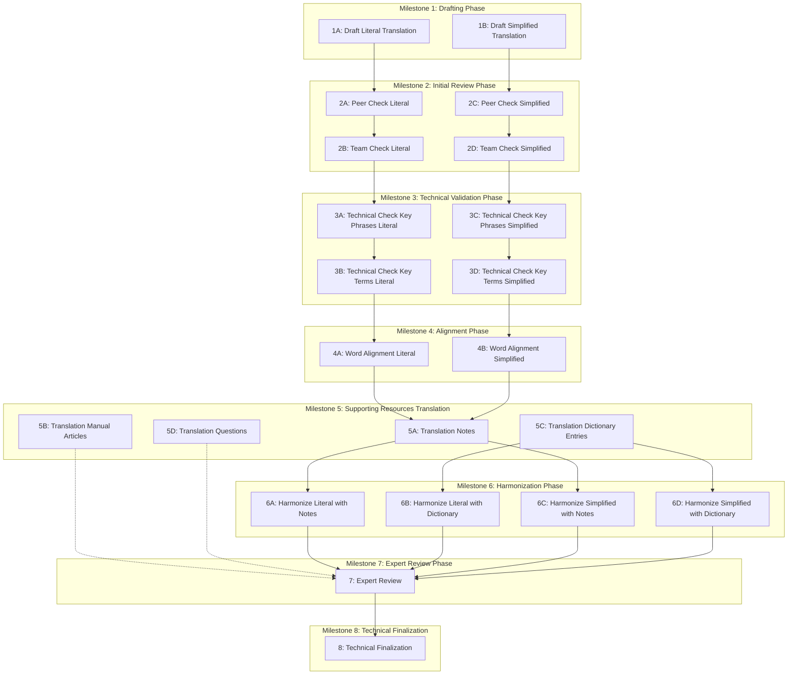

# Book Translation Package Production Process: Workflow Visualization

This document provides visual representations of the existing Book Translation Package creation workflow and explains the dependencies between different milestones and components. Understanding these workflows is essential for designing our Biblical Translation Project Management System to effectively support the translation process.

## Established Workflow Structure

The Book Translation Package Production Process follows a structured workflow with clear dependencies and parallel tracks. Our project management application will be designed to represent, track, and optimize this workflow.

## Repository Integration

The workflow integrates with the structured organization of resources in dedicated Git repositories within the Door43 Content Service (DCS) platform. The established workflow leverages this modular repository approach to enable:

- **Parallel Development Tracks**: Teams can work concurrently on different repositories (e.g., literal translation, simplified translation, notes)
- **Clear Milestone Transitions**: Each repository progresses through the milestones with clear handoff points
- **Dependency Management**: The repository structure maps to the dependencies shown in the workflow diagram
- **Integration Points**: Repositories come together at specific milestones (particularly alignment and harmonization)
- **Progress Tracking**: Status can be monitored across repositories to visualize overall project advancement

## Process Flow Diagram

The following diagram represents the established workflow of the Book Translation Package Production Process:

## Dependencies in the Established Process

The translation process involves several key dependencies:

1. **Sequential Dependencies for Each Track**:
   - Literal Translation progresses from Drafting → Initial Review → Technical Validation → Alignment
   - Simplified Translation follows the same sequence in parallel

2. **Cross-Track Dependencies**:
   - Both Literal and Simplified Translations must reach Alignment phase (M4) before Translation Notes (M5A) can begin
   - Translation Notes and Dictionary Entries must be complete before Harmonization (M6) can start

3. **Final Phase Dependencies**:
   - All Harmonization tasks must be complete before Expert Review
   - Expert Review must be complete before Technical Finalization

## Parallel Work Opportunities in the Established Process

The workflow is designed to optimize efficiency through parallel work opportunities:

1. **Parallel Initial Development**:
   - Literal and Simplified translations can be drafted and reviewed simultaneously
   - Their development tracks remain independent until Milestone 5

2. **Supporting Resources Parallelization**:
   - Once translations reach Milestone 4, multiple supporting resources can be developed concurrently
   - Translation Notes, Manual Articles, Dictionary Entries, and Questions can all progress in parallel

3. **Harmonization Parallelization**:
   - Multiple harmonization tasks can be performed simultaneously once their dependencies are met

## Critical Path in the Established Process

The critical path through the translation process typically follows the sequence below:

1. Draft Literal Translation
2. Review and Technical Validation of Literal Translation  
3. Alignment of Literal Translation
4. Creation of Translation Notes
5. Harmonization of Literal Translation with Notes
6. Expert Review
7. Technical Finalization

This represents the minimum sequence of steps required to complete a Book Translation Package. Delays in any of these steps will directly impact the project timeline, while other steps (like Simplified Translation) usually have some float time.

## How Our Biblical Translation Project Management System Will Support This Workflow

Our project management application will provide specialized features to support, visualize, and optimize this established workflow:

### Workflow Visualization

Our application will:
- Provide interactive diagrams of the translation workflow
- Show real-time status of each task and milestone
- Highlight critical path elements and potential bottlenecks
- Visualize dependencies between different tracks

### Dependency Management

Our application will:
- Enforce prerequisite completion before dependent tasks can start
- Alert project managers when dependencies may cause delays
- Facilitate handoffs between sequential tasks
- Maintain cross-repository dependencies

### Parallel Work Coordination

Our application will:
- Identify opportunities for parallel work
- Help allocate resources across parallel tracks
- Track progress of independent work streams
- Highlight when parallel tracks need to converge

### Critical Path Monitoring

Our application will:
- Identify and highlight critical path tasks
- Provide early warnings for potential delays in critical tasks
- Calculate float time for non-critical tasks
- Help optimize resource allocation to maintain critical path progress

### Progress Tracking Features

The Biblical Translation Project Management System will provide tools to track progress through this workflow, including:

- **Status Dashboards**: Visual representation of milestone and task status
- **Task Visualization**: Kanban-style boards showing completed, in-progress, and pending tasks
- **Resource Allocation Tracking**: Monitoring of team member assignments across parallel tracks
- **Bottleneck Identification**: Automated highlighting of workflow constraints
- **Timeline Projections**: Forecasts based on current progress and resource allocation

### Adaptability for Other Translation Processes

While initially focused on supporting the Book Translation Package Production Process, our system will be designed with the flexibility to support other translation workflows in the future, such as:

- **Minority Language Bible Translation**: Direct translation from gateway languages to minority languages
- **Specialized Resource Creation**: Creation of specific resources like commentaries or study guides
- **Custom Workflows**: User-defined workflow creation for specialized translation projects

---

Next: View the [Technical Details](./technical.md)  
Return to [Documentation Home](./README.md) 