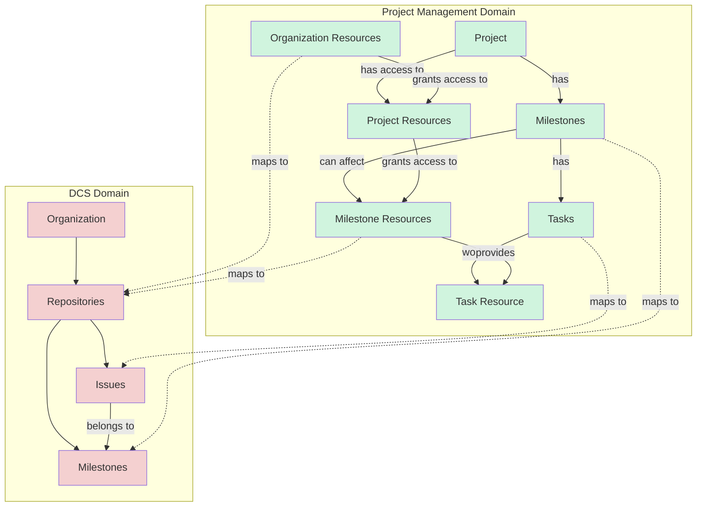
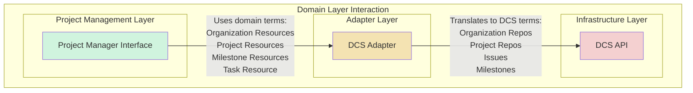
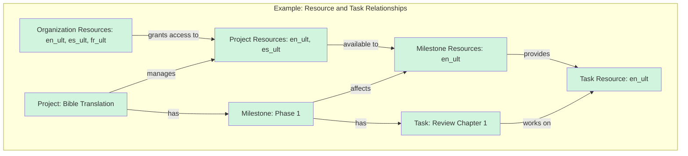
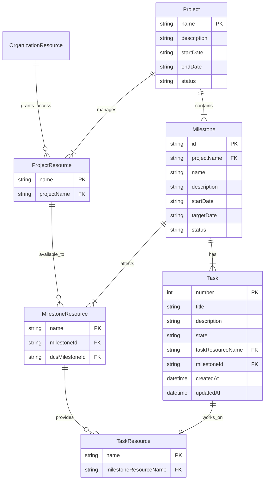

# Domain Layer Documentation

## Domain Flow Diagram

## Layer Interaction Diagram

## Example Resource Flow

## Entity Relationship Diagram

# Domain Layer Explanation

## Project Management Domain (Business Layer)
- **Organization Resources**: The complete pool of available translatable content units at the organization level
- **Project Resources**: Resources from the organization that a project has permission to manage
- **Milestone Resources**: Resources from the project that a milestone can affect or modify
- **Task Resource**: The specific resource from the milestone's scope that a task works on
- **Project**: A translation initiative with defined scope and timeline
- **Milestones**: Project phases or deadlines
- **Tasks**: Work items that operate on a specific resource within a milestone's context

## Resource Relationships
1. **Organization Resources → Project Resources**
   - Organization maintains the complete pool of available resources
   - Projects are granted access to specific resources they can manage

2. **Project Resources → Milestone Resources**
   - Milestones can only affect resources that their project has access to
   - Each milestone defines which project resources it will modify

3. **Milestone Resources → Task Resource**
   - Tasks can only work on resources that their milestone can affect
   - Each task focuses on exactly one resource from its milestone's scope

## DCS Domain (Infrastructure Layer)
- **Organization**: Container for all repositories
- **Repository**: Storage unit for version-controlled content
- **Issues**: Tracking units for work items, linked to repositories
- **Milestones**: Grouping mechanism for issues within repositories

## Adapter Layer
The adapter layer handles these access relationships:
- Maps Organization Resources to DCS Repositories
- Maps Project Resource access to repository permissions
- Maps Milestone Resources to specific repository-milestone combinations
- Maps Tasks and their Task Resource to Issues while maintaining proper access scope

## Key Differences
1. **Resource Access Levels**
   - Project Management: Resources have cascading access control (organization → project → milestone → task)
   - DCS: Repositories have simple organization-level access

2. **Task Context**
   - Project Management: Tasks work on a single resource within their milestone's scope
   - DCS: Issues are linked to repositories and optionally to milestones

3. **Relationship Management**
   - Project Management: Hierarchical access control and scope of influence
   - DCS: Basic parent-child relationships only 