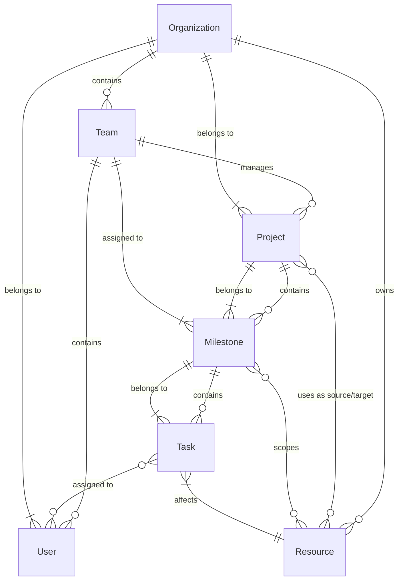

# Project Management System

A modular, extensible framework for managing translation projects, resources, milestones, and tasks with team collaboration.

## Table of Contents

- [Project Management System](#project-management-system)
  - [Table of Contents](#table-of-contents)
  - [Architecture](#architecture)
  - [Configuration](#configuration)
  - [Components](#components)
    - [Domain Models](#domain-models)
    - [Data Model Relationships (ER Diagram)](#data-model-relationships-er-diagram)
    - [Data Schema](#data-schema)
      - [Organization](#organization)
      - [User](#user)
      - [Team](#team)
      - [Resource](#resource)
      - [Project](#project)
      - [Milestone](#milestone)
      - [Task](#task)
    - [Storage Services](#storage-services)
    - [Manager Classes](#manager-classes)
  - [Team \& User Management](#team--user-management)
    - [Role-Based Team Examples](#role-based-team-examples)
  - [Resource Management](#resource-management)
  - [Usage Examples](#usage-examples)
  - [Type Safety](#type-safety)

## Architecture

This system follows a clean, layered architecture with dependency injection:

- **Domain Models**: Core data structures representing business entities
- **Storage Services**: Implementations for data persistence (IndexedDB, RxDB)
- **Manager Classes**: Business logic layer for working with entities
- **Type Definitions**: Interfaces and types for type safety

## Configuration

Before using the system, you should configure it with organization and authentication details:

```typescript
import { configureProjectManager, getProjectManager, getUserManager, getOrganizationManager } from './project-manager';

// Configure with organization and authentication
configureProjectManager({
  organizationId: 'your-organization-id', // Required for all storage types
  token: 'your-auth-token', // Required only for remote API-based storage services
  apiUrl: 'https://custom-api-url.com/api/v1' // Optional for remote API-based storage services
});

// Get the configured managers
const projectManager = getProjectManager();
const userManager = getUserManager();
const organizationManager = getOrganizationManager();
```

## Components

### Domain Models

- `Organization`: A group that owns resources and projects
  - Contains teams and manages access across the organization
- `User`: A user within the system associated with an organization
  - Can be assigned to teams and tasks
- `Team`: A group of users that work together
  - Teams are assigned to projects and milestones
- `Resource`: A translation resource (content to be translated)
- `Project`: Connects source resources to target resources
  - Has a `status` that can be `active`, `complete`, or `archived`
  - Assigned to a specific team
- `Milestone`: A subunit of work within a project
  - Assigned to a team (must match project team)
- `Task`: A specific unit of work within a milestone
  - Assigned to one or more users from the milestone's team

### Data Model Relationships (ER Diagram)

The system implements this entity relationship model:



The diagram illustrates:

- **Organizations** own Resources and contain Teams
- **Teams** contain multiple Users
- **Users** belong to Organizations and can be assigned to multiple Tasks
- **Resources** belong to Organizations and are used by Projects (as source/target)
- **Projects** belong to an Organization and are assigned to a Team
  - Projects reference source and target Resources
- **Milestones** belong to a Project and inherit its Team
  - Milestones define a resourceScope (subset of project target resources)
- **Tasks** belong to a Milestone and are assigned to Users from the Team
  - Tasks reference a single resource from the milestone's resourceScope

### Data Schema

The system uses the following data structure for each entity:

#### Organization

```typescript
{
  id: string;                // Unique identifier
  type: 'organization';      // Entity type
  name: string;              // Organization name
  teamIds: string[];         // References to teams in this organization
}
```

#### User

```typescript
{
  id: string;                // Unique identifier
  type: 'user';              // Entity type
  name: string;              // User's full name
  email: string;             // User's email address
  organizationId: string;    // Reference to parent organization
}
```

#### Team

```typescript
{
  id: string;                // Unique identifier
  type: 'team';              // Entity type
  name: string;              // Team name
  organizationId: string;    // Reference to parent organization
  userIds: string[];         // References to users in this team
}
```

#### Resource

```typescript
{
  id: string;                // Unique identifier
  type: 'resource';          // Entity type
  name: string;              // Resource name
  path: string;              // Path to the resource
  organizationId: string;    // Reference to parent organization
  contentType: string;       // Type of content (e.g., text, markdown)
  language: string;          // Language code (e.g., 'en', 'es')
  version?: string;          // Optional version identifier
}
```

#### Project

```typescript
{
  id: string;                // Unique identifier
  type: 'project';           // Entity type
  name: string;              // Project name
  organizationId: string;    // Reference to parent organization
  teamId: string;            // Team assigned to this project
  sourceResources: string[]; // Resource IDs used as input
  targetResources: string[]; // Resource IDs being created/modified
  status: 'active' | 'complete' | 'archived'; // Project status
  description?: string;      // Optional project description
}
```

#### Milestone

```typescript
{
  id: string;                // Unique identifier
  type: 'milestone';         // Entity type
  name: string;              // Milestone name
  projectId: string;         // Reference to parent project
  teamId: string;            // Team assigned to this milestone
  resourceScope: string[];   // Subset of project resources
}
```

#### Task

```typescript
{
  id: string;                // Unique identifier
  type: 'task';              // Entity type
  name: string;              // Task name
  milestoneId: string;       // Reference to parent milestone
  assignedUserIds: string[]; // Users assigned to this task
  resourceId: string;        // Resource being affected by this task
  status: 'open' | 'closed'; // Task status
  description?: string;      // Optional task description
}
```

### Storage Services

- `IStorageService`: Interface defining storage operations
- `IndexedDBStorageService`: Implementation using native IndexedDB
- `RxDBStorageService`: Implementation using RxDB (reactive database)

### Manager Classes

- `ProjectManager`: Handles project, milestone, and task operations
  - Provides cascading deletion and validation
  - Manages team assignments and user collaboration

- `UserManager`: Handles user and team operations
  - Creates and manages users within organizations
  - Creates and manages teams with assigned users
  - Retrieves users by organization, team, and other criteria

- `OrganizationManager`: Handles organization operations
  - Creates and manages organizations
  - Provides organization-level settings and management

## Team & User Management

The system implements a hierarchical team management model that supports both work groups and role-based access:

1. **Organizations** contain multiple teams
2. **Teams** can represent:
   - **Work groups**: Collections of users working together on specific projects
   - **Role-based groups**: Users with specific capabilities (e.g., Admins, Translators, Reviewers)
3. **Projects** are assigned to a team
4. **Milestones** are assigned to the same team as their parent project
5. **Tasks** are assigned to specific users from the milestone's team

This creates a clear hierarchy of responsibility and collaboration:

```
Organization
  └── Teams (work groups or roles)
      └── Projects
          └── Milestones
              └── Tasks (assigned to users)
```

### Role-Based Team Examples

Teams can be structured in various ways to support your workflow:

```typescript
// Create role-based teams
const adminTeam = await userManager.createTeam("Administrators", [john.id, mary.id]);
const translatorTeam = await userManager.createTeam("Translators", [bob.id, alice.id]);
const reviewerTeam = await userManager.createTeam("Reviewers", [sam.id, kate.id]);

// Assign projects to functional teams
const translationProject = await projectManager.createProject(
  "Bible Translation", 
  translatorTeam.id, // Only translators can work on this project
  ["source-texts"],
  ["target-texts"]
);

// Check user roles
const isAdmin = (await userManager.getUsersByTeam(adminTeam.id))
  .some(user => user.id === currentUserId);
```

This approach allows for flexible permission structures while maintaining a clean data model.

## Resource Management

The system implements a hierarchical resource management model:

1. **Projects** define:
   - Source resources (input materials)
   - Target resources (output translations)

2. **Milestones** use:
   - A subset of a project's target resources

3. **Tasks** reference:
   - A single resource from a milestone's scope

This creates a clear hierarchy of resource access and responsibility.

## Usage Examples

```typescript
// Configure the system first
configureProjectManager({
  organizationId: 'org123',
  token: 'auth-token-here'
});

// Initialize the system
const projectManager = getProjectManager();
await projectManager.initialize();

// Create users and a team
const john = await projectManager.createUser("John Doe", "john@example.com");
const mary = await projectManager.createUser("Mary Smith", "mary@example.com");
const translationTeam = await projectManager.createTeam("Translation Team", [john.id, mary.id]);

// Create a project assigned to the team
const project = await projectManager.createProject(
  "NT Translation", 
  translationTeam.id,
  ["greek-nt"], // source resources
  ["spanish-nt", "french-nt"], // target resources
  "Translation of the New Testament"
);

// Update a project's status
const updatedProject = await projectManager.updateProject({
  ...project,
  status: 'complete'
});

// Get all active projects for the configured organization
const activeProjects = (await projectManager.getCurrentOrganizationProjects())
  .filter(project => project.status === 'active');

// Create a milestone for a subset of target resources
const milestone = await projectManager.createMilestone(
  "Gospels Translation",
  project.id,
  translationTeam.id,
  ["spanish-nt"] // Only focus on Spanish for this milestone
);

// Create a task assigned to a specific user
const task = await projectManager.createTask(
  "Translate Matthew",
  milestone.id,
  "spanish-nt",
  [john.id] // Assign to John
);

// Get all tasks assigned to a specific user
const johnsTask = await projectManager.getTasksByUser(john.id);

// Get all projects for the configured organization
const myProjects = await projectManager.getCurrentOrganizationProjects();

// Get all users in a specific team
const teamMembers = await projectManager.getUsersByTeam(translationTeam.id);
```

## Type Safety

The system is fully typed to provide compile-time safety and IDE assistance.
